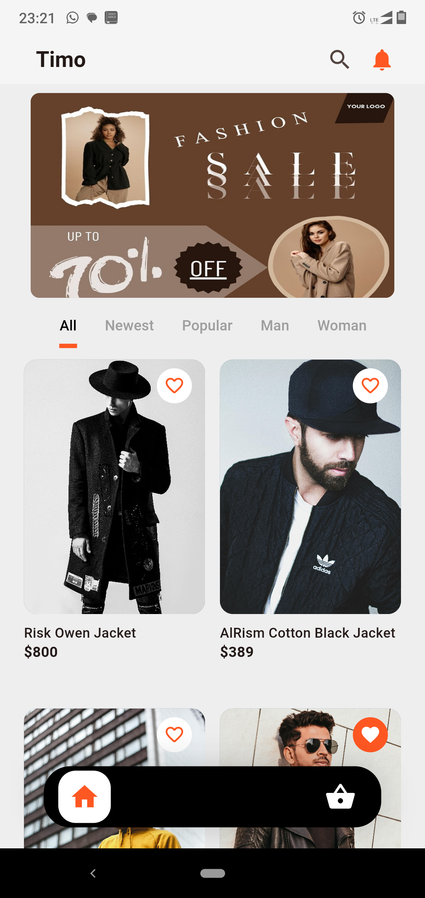

# HNG Mobile Dev: Stage One Task  - Timo

---


## Table of contents

- [Overview](#overview)
- [Task Requirement](#task-requirement)
- [Solution](#solution)
- [Screenshot](#screenshot)
- [Features](#features)
- [The process](#the-process)
  - [Built with](#built-with)
  - [Installation](#installation)
  - [Useful resources](#useful-resources)
- [APK Download](#apk-download)
- [Author](#author)
- [Contributing](#contributing)
- [License](#license)

## Overview

This is a solution to the mobile dev stage one task of Simple Shooping App organised by [HNG](https://hmg.tech/internship). HNG internship help you improve your coding skills by building realistic projects. Task was to create a simple shopping app that is showing a list of products/items (statically) in a shop and a checkout screen.

## Task Requirement

- A bottom navigation bar consisting of Products and Checkout items
- Products will displays the list of products/items, Checkout will display the products added for checkout.
- Have the functionality of adding and removing items to the Checkout .
- A button that navigates to an Order Successful screen from the Checkout screen.

## Solution

Timo Store is a robust and feature-rich mobile application built using Flutter For the purpose of HNG Task 1. The app provides a seamless shopping experience with a compelling UI, allowing users to browse products, view more details about a specific productadd them to the cart, and proceed to checkout.

### Screenshot


## Features

- Browse products by categories
- View specific product in product detail page
- Add products to the cart
- Select color and size while adding product to cart
- View and manage the cart and checkout amount
- Checkout process
- Responsive and adaptive UI

## The process

### Built with

- Flutter and Dart

### What I learnt

I learnt a great deal working on this project, implementing add to cart and remove fom cart, making it reponsive and preventing screen overflow, I tried different methods of resolving the pixel overflow issue but the best was to use mediaquery rather than hard coding desired width and height, mediaquery exposes the device screen width and height and other component which enable one to create a better responsive realistic app that looks good on different mobile devices.

To access device width and height the following command can be used to access the size of the running device using mediaquery.

```dart
final size = MediaQuery.of(context).size;

```

After accessing  the size of the device the width or height can easily be expose including default padding, this will enable one to properly calculate available space to fit in ones design

```dart
//Exposes the device width
size.width;

//Exposes device height
size.height;

}
```

I created a list of dummy products that model the actual product which include the real image, product name, description, list of colors, list of sizes etc.

```dart

class ProductModel {
  final String img;
  final String name;
  final String price;
  final String description;
  final bool isBestSeller;
  final List<Color> listedColors;
  final String rating;
  final List<String> sizes;

  ProductModel({
    required this.rating,
    required this.listedColors,
    required this.sizes,
    required this.img,
    required this.name,
    required this.price,
    required this.description,
    required this.isBestSeller,
  });
}

List<ProductModel> dummyProducts = [
  ProductModel(
      listedColors: [Colors.green, Colors.red, Colors.black],
      sizes: ['S', 'M', 'L', 'XL', 'XXL'],
      img: 'assets/images/product1.jpg',
      name: 'Risk Owen Jacket',
      price: '800',
      description:
          'Lorem ipsum dolor sit amet, consectetur adipiscing elit, sed do eiusmod tempor incididunt ut labore et dolore magna aliqua. Elementum nisi quis eleifend quam adipiscing vitae proin. Pellentesque eu tincidunt tortor aliquam nulla facilisi cras fermentum. Quis blandit turpis cursus in hac.',
      isBestSeller: false,
      rating: '4.6'),
  ProductModel(
      listedColors: [Colors.green, Colors.white, Colors.black],
      sizes: ['S', 'M', 'XL', 'XXL'],
      img: 'assets/images/product2.jpg',
      name: 'AlRism Cotton Black Jacket',
      price: '389',
      description:
          'Lorem ipsum dolor sit amet, consectetur adipiscing elit, sed do eiusmod tempor incididunt ut labore et dolore magna aliqua. Iaculis eu non diam phasellus. Sit amet est placerat in egestas erat imperdiet. Rhoncus est pellentesque elit ullamcorper dignissim cras. Neque egestas congue quisque egestas diam in arcu. Integer vitae justo eget magna fermentum.',
      isBestSeller: false,
      rating: '5.0'),
  ProductModel(
      listedColors: [Colors.blue, Colors.red, Colors.black],
      sizes: ['S', 'M', 'L', 'XL', 'XXL'],
      img: 'assets/images/product3.jpg',
      name: 'Ninja Hoody',
      price: '800',
      description:
          'Lorem ipsum dolor sit amet, consectetur adipiscing elit, sed do eiusmod tempor incididunt ut labore et dolore magna aliqua. Ornare arcu dui vivamus arcu felis bibendum. Accumsan sit amet nulla facilisi morbi. Adipiscing at in tellus integer. Ac tortor vitae purus faucibus ornare suspendisse sed. Sapien faucibus et molestie ac feugiat sed lectus.',
      isBestSeller: false,
      rating: '3.6'),
  ProductModel(
      listedColors: [
        Colors.orange,
        Colors.red,
        Colors.black
      ],
      sizes: [
        'S',
        'M',
        'L',
        'XL',
      ],
      img: 'assets/images/product4.jpg',
      name: 'Police Jacket',
      price: '900',
      description:
          'Lorem ipsum dolor sit amet, consectetur adipiscing elit, sed do eiusmod tempor incididunt ut labore et dolore magna aliqua. Amet consectetur adipiscing elit ut aliquam purus sit amet luctus. Odio aenean sed adipiscing diam. Duis ultricies lacus sed turpis tincidunt id aliquet risus feugiat. Magna sit amet purus gravida quis blandit.',
      isBestSeller: true,
      rating: '2.7'),
  ProductModel(
      listedColors: [Colors.green, Colors.grey, Colors.black],
      sizes: ['S', 'M', 'L', 'XL', 'XXL'],
      img: 'assets/images/product5.jpg',
      name: 'Crazy Jeans',
      price: '800',
      description:
          'Lorem ipsum dolor sit amet, consectetur adipiscing elit, sed do eiusmod tempor incididunt ut labore et dolore magna aliqua. Eu consequat ac felis donec. Orci nulla pellentesque dignissim enim sit amet venenatis urna cursus. Adipiscing commodo elit at imperdiet dui accumsan sit amet nulla. Dolor magna eget est lorem ipsum dolor sit.',
      isBestSeller: true,
      rating: '3.5'),
  
];

}
```

## Installation

### Prerequisites

- Flutter SDK: [Install Flutter](https://flutter.dev/docs/get-started/install)
- Android Studio or Visual Studio Code: Recommended for development and testing
- A device or emulator to run the app

### Setup Instructions

1. **Clone the repository**

   ```bash
   git clone https://github.com/yourusername/timo_stores.git
   cd timo_stores
   ```

2. **Install dependencies**

   ```bash
   flutter pub get
   ```

3. **Run the app**

   Connect your device or start an emulator, then run:

   ```bash
   flutter run
   ```

### Useful resources

Check out these few resources to get you started if this is your first flutter project:

- [Lab: Write your first Flutter app](https://docs.flutter.dev/get-started/codelab)
- [Cookbook: Useful Flutter samples](https://docs.flutter.dev/cookbook)

## APK Download

Download the latest version of the app from the link below:

[Download APK](timo.apk)

## Author

- Uma Godwin Eke
- Linkedin - [@godwinekeuma](https://www.linkedin.com/in/godwinekeuma)
- Email - [godwinekeuma@gmail.com](https://www.frontendmentor.io/profile/yourusername)
- Twitter - [@godwinekeuma](https://www.twitter.com/godwinekeuma)

## Contributing

Contributions are welcome! If you'd like to contribute, please follow these steps:

1. Fork the repository
2. Create a new branch: `git checkout -b feature/your-feature-name`
3. Make your changes
4. Commit your changes: `git commit -m 'Add some feature'`
5. Push to the branch: `git push origin feature/your-feature-name`
6. Submit a pull request

Please ensure your code adheres to the existing code style and includes appropriate tests.

## License

This project is licensed under the MIT License - see the [LICENSE](LICENSE) file for details.
